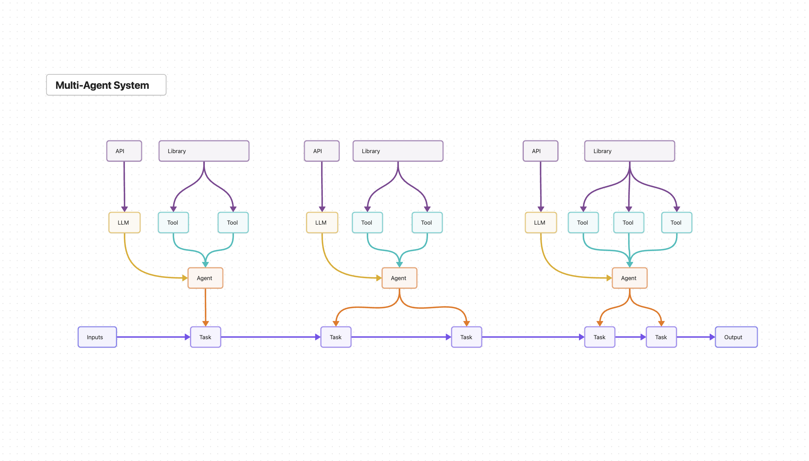

# TaskFlowAI: A Flexible Framework for Building AI-Driven Task Pipelines and Workflows

TaskFlowAI is a lightweight and flexible framework designed for creating AI-driven task pipelines and workflows. It provides developers with a streamlined approach to building agentic systems without unnecessary abstractions or cognitive overhead. 

The framework is built on two foundational blocks: tasks, which are discrete units of work, and agents, which are personas that perform the work and can be assigned tools to use. This task-forward approach allows for efficient and modular construction of AI-driven systems.

## Multi-Agent System Architecture



*Figure 1: Architecture diagram of a multi-agent system in TaskFlowAI*

## Table of Contents
- [Why TaskFlowAI? Core Philosophy](#why-taskflowai-core-philosophy)
- [Key Features](#key-features)
  - [Modular Architecture](#modular-architecture)
  - [Flexible Workflow Design](#flexible-workflow-design)
  - [Agent-Task Relationship](#agent-task-relationship)
  - [Minimal Dependencies and Transparency](#minimal-dependencies-and-transparency)
  - [Advanced Tool Assignment and Usage](#advanced-tool-assignment-and-usage)
  - [Diverse Language Model Support](#diverse-language-model-support)
  - [Comprehensive Toolset](#comprehensive-toolset)
  - [Transparency and Observability](#transparency-and-observability)
  - [Minimal Dependencies](#minimal-dependencies)
  - [Flexible Workflow Creation](#flexible-workflow-creation)
  - [Best Practices Integration](#best-practices-integration)
  - [Extensibility](#extensibility)
- [Core Components](#core-components)
  - [Tasks](#tasks)
  - [Agents](#agents)
  - [Tools](#tools)
  - [Language Model Interfaces](#language-model-interfaces)
- [Workflow Creation](#workflow-creation)
- [Project Structure](#project-structure)
  - [Directory Layout](#directory-layout)
  - [Component Interactions](#component-interactions)
- [Getting Started](#getting-started)
- [Examples](#examples)
  - [Agentic System with Tool Use](#agentic-system-with-tool-use)
  - [Multi-Agent Systems](#multi-agent-systems)
- [Verbosity of LLM Calls](#verbosity-of-llm-calls)
- [Conclusion](#conclusion)

## Why TaskFlowAI? Core Philosophy

TaskFlowAI is designed to be a singular framework that enables the creation and orchestration of both deterministic pipelines and fully agentic teams. 

Its core philosophy revolves around offering simple, intuitive, and flexible building blocks that enable developers to orchestrate AI-driven workflows suited to their specific needs, whether it's a simple linear pipeline or a complex multi-agent system.

## Key Features

### Modular Architecture

TaskFlowAI's modular architecture is a cornerstone of its design, providing developers with the flexibility to adapt the framework to their projects.

- **Partial Implementation**: Developers can select specific components of TaskFlowAI and integrate them into existing projects without the need to adopt the entire framework.
- **Easy Extension**: The modular design facilitates the addition of custom tasks, tools, agents, and language model integrations, allowing developers to tailor the framework to their needs.
- **Plug-and-Play Components**: Tasks, tools, agents, and language models can be effortlessly swapped or combined, enabling the creation of diverse and customized workflows.

### Flexible Workflow Design

TaskFlowAI offers a spectrum of workflow design options, ranging from deterministic pipelines to fully autonomous agent teams.

- **Deterministic Pipelines**: Developers can create linear pipelines where tasks are executed in a predefined sequence, suitable for simpler and more predictable workflows.
- **Agentic Teams**: TaskFlowAI supports the creation of multi-agent systems where agents have full autonomy and self-determined tool usage capabilities. Agents can dynamically select and utilize tools based on the task at hand, enabling more adaptive and intelligent workflows.

### Agent-Task Relationship

In TaskFlowAI, agents are defined with specific roles, goals, attributes, and language models. Agents can be assigned to tasks, bringing their capabilities and decision-making abilities to the execution of the task.

- **Task Assignment**: Agents are assigned to tasks, which bring their specific capabilities, expected behaviors, and decision-making abilities to the execution of the task.
- **Flexible Agent Definition**: Agents can be created as independent entities and reused across tasks, or they can be instantiated directly within a task for specific use cases.

### Minimal Dependencies and Transparency

TaskFlowAI is built with a focus on minimalism and transparency, ensuring ease of use and maintainability.

- **Minimal Dependencies**: The framework relies on a minimal set of dependencies, reducing complexity and potential compatibility issues. This lightweight approach enables easier integration into existing projects and reduces security risks.
- **Transparency**: TaskFlowAI provides a flat and transparent structure, avoiding black-box components. Developers have full visibility into the inner workings of the framework, enabling better understanding, debugging, and optimization of their AI workflows.

### Advanced Tool Assignment and Usage

TaskFlowAI provides capabilities for advanced tool assignment and usage within tasks.

- **Dynamic Tool Assignment**: Tools can be assigned to agents or tasks, based on the requirements of the workflow and the intended degree of agency.
- **Self-Determined Tool Use**: Agents can autonomously decide which tools to use and when, based on the task context and their defined capabilities.
- **Tool Usage Optimization**: The framework includes mechanisms to prevent unnecessary tool usage and optimize the sequence of tool calls.

### Diverse Language Model Support

TaskFlowAI provides robust support for a variety of Language Models (LLMs).

- **Multiple LLM Providers**: Out-of-the-box support for OpenAI, Anthropic, and OpenRouter models.
- **Consistent Interface**: The `llm.py` module provides a uniform interaction model for all supported LLMs, simplifying integration and switching between models.
- **Performance Optimization**: Easily switch between LLMs to balance speed, cost, and capabilities based on specific task requirements.

### Comprehensive Toolset

TaskFlowAI comes equipped with a versatile set of built-in tools, enhancing the framework's capabilities and simplifying common operations.

- **Web Interaction**: `WebTools` provides functions for web scraping, API interactions, and search operations.
- **File Operations**: `FileTools` simplifies file reading, writing, and manipulation tasks.
- **Calculation and Date Handling**: `CalculatorTools` provides functions for basic math operations, date calculations, and time-related tasks.
- **Embeddings Generation**: `EmbeddingsTools` offers capabilities to generate embeddings using various models from OpenAI and Cohere.
- **Code Analysis**: `CodeTools` includes functions for parsing and analyzing Python code, such as extracting classes from files.
- **Audio Processing**: `AudioTools` provides functionalities for transcribing and translating audio files using OpenAI's Whisper model.
- **GitHub Integration**: `GitHubTools` offers methods to interact with GitHub repositories, including fetching issues and comments.
- **ArXiv Integration**: `ArxivTools` allows querying the ArXiv API for scientific papers and related information.

### Transparency and Observability

TaskFlowAI prioritizes transparency in its operations, aiding in debugging, optimization, and understanding of the AI workflow.

- **Detailed Logging**: API interactions are logged, providing visibility into the communication between tasks, agents, and language models.
- **State Exposure**: Task, agent, and workflow states are easily accessible, allowing for real-time monitoring and analysis.
- **Clear Prompt Structure**: The separation of fields in the dynamic prompt construction enhances readability and facilitates prompt engineering.

### Minimal Dependencies

TaskFlowAI maintains a lightweight footprint, minimizing external dependencies to ensure easy integration and reduced security risks.

- **Core Dependencies**: Relies on a small set of essential libraries like `requests`, `openai`, `anthropic`, and `pydantic`.
- **Optional Integrations**: Additional functionalities can be enabled through optional dependencies, keeping the base installation lean.

### Flexible Workflow Creation

TaskFlowAI offers multiple approaches to workflow creation:

- **Independent Agents**: Create reusable agents that can be assigned to multiple tasks across different workflows.
- **In-Task Instantiated Agents**: Define agents directly within tasks for specific, one-time use cases.
- **Pipeline Creation**: Easily create linear pipelines without the need for separate agents, suitable for simpler, deterministic workflows.
- **Multi-Agent Systems**: Design complex workflows with multiple interacting agents, each with its own role and capabilities.

### Best Practices Integration

TaskFlowAI incorporates industry best practices, ensuring reliability and efficiency in production environments.

- **Structured Prompt Engineering**: The Task and Agent classes enforce a clear structure for prompts, promoting consistency and effectiveness in LLM interactions.
- **Error Handling**: Robust error handling mechanisms are built into the framework, particularly for API interactions and task execution.
- **Rate Limiting**: Implements strategies to respect API rate limits, ensuring smooth operation in high-volume scenarios.

### Extensibility

TaskFlowAI is designed with extensibility in mind, allowing developers to adapt and expand the framework to meet specific project needs.

- **Custom Task Types**: Developers can create new task types to handle specialized workflows or integrate with domain-specific tools.
- **Custom Agent Types**: New agent types can be defined to encapsulate specific roles, goals, and attributes.
- **Tool Development**: The framework supports the addition of custom tools, enabling integration with new APIs or services.
- **LLM Integration**: New language models can be easily added to the `llm.py` module, keeping the framework up-to-date with the latest AI advancements.

## Core Components

### Tasks

Tasks are the fundamental building blocks of TaskFlowAI. Each task represents a single, discrete unit of work to be performed by a language model. The `Task` class provides a structured way to define tasks with specific roles, goals, attributes, instructions, context, tools, and language models.

### Agents

Agents in TaskFlowAI are entities that perform tasks. They are defined by their role, goal, attributes, language model, and optional tools. Agents bring their specific capabilities and decision-making abilities to the execution of tasks. The `Agent` class allows for the creation of reusable agents that can be assigned to multiple tasks across different workflows. 

### Tools

Tools in TaskFlowAI are wrappers around external services, APIs, or specific functionalities. They provide a uniform interface for interacting with these services, abstracting away implementation details. TaskFlowAI comes with a comprehensive set of built-in tools, such as `WebTools`, `FileTools`, `CalculatorTools`, and more. Developers can also create custom tools to extend the framework's capabilities.

### Language Model Interfaces

TaskFlowAI supports various Language Models (LLMs) out-of-the-box, including OpenAI, Anthropic, and OpenRouter models. The `llm.py` module provides a consistent interface for interacting with different LLM providers, allowing easy switching between models to optimize performance, cost, or capabilities.

## Workflow Creation

In TaskFlowAI, workflows can be created using different approaches:

- **Sequenced Pipelines**: Tasks can be chained together in a specific order, where the output of one task becomes the input for a tool, or the next task. This approach is suitable for simpler, deterministic workflows.
- **Agent-based Systems**: Agents can be assigned to tasks, bringing their specific approach and tools to the execution of the task. This approach allows for more flexible and adaptive workflows.
- **Multi-Agent Systems**: Complex workflows can be designed with multiple interacting agents, each with its own role and capabilities. Agents can collaborate and communicate to accomplish the overall goal of the workflow.

## Project Structure

### Directory Layout

TaskFlowAI follows a modular directory structure:

```
taskflowai/
├── taskflowai/
│   ├── task.py
│   ├── agent.py
│   ├── tools.py
│   ├── utils.py
│   └── llm.py
│   requirements.txt
└── README.md
```

### Component Interactions

Understanding how the components interact is crucial for effective use of TaskFlowAI:

- **Tasks and Agents**: Agents are assigned to tasks.
- **Agents and Tools**: Agents can dynamically select and utilize tools based on the task context and their defined capabilities.
- **Tasks, Agents, and LLMs**: Tasks and agents use language models to perform their work. The choice of *language model can be specified at the task or agent level*, allowing for flexibility and optimization based on the specific requirements of each component.

## Getting Started

To get started with TaskFlowAI, follow these steps:

1. Clone the TaskFlowAI repository:
   ```
   git clone https://github.com/philippe-page/taskflowai
   ```

2. Install the required dependencies:
   ```
   pip install -r requirements.txt
   ```

3. Explore the examples to see sample workflows and usage patterns.

4. Create your own workflows by defining tasks, agents, and tools in the `taskflowai/` directory.

5. Integrate TaskFlowAI into your projects by importing the necessary components:
   ```python
   from taskflowai.task import Task
   from taskflowai.agent import Agent
   from taskflowai.tools import WebTools, FileTools
   from taskflowai.llm import OpenAIModels, AnthropicModels, OpenRouterModels
   ```

6. Customize and extend TaskFlowAI by adding new tools, agents, or language model integrations to suit your specific requirements.

## Examples

### Agentic System with Tool Use

Here's an example of creating an agentic system that utilizes tools to perform specific tasks:

```python
from taskflowai.task import Task
from taskflowai.agent import Agent
from taskflowai.tools import WebTools
from taskflowai.llm import OpenRouterModels

agent = Agent(
    role="research assistant",
    goal="answer user queries",
    attributes="thorough in web research, writes extensive reports",
    tools={"web_search": WebTools.serper_search},
    llm=OpenRouterModels.haiku
)

def research_task(user_query, history):
    return Task.create(
        agent=agent,
        instruction=f"Answer the query based on the conversation history:\n{history}\n\nUser query: {user_query}"
    )

def main():
    history = ""
    while True:
        user_query = input("Enter a question (or 'exit'): ")
        if user_query.lower() == 'exit':
            break
        history += f"User: {user_query}\n"
        response = research_task(user_query, history)
        history += f"Assistant: {response}\n"
        print(f"Assistant: {response}")

if __name__ == "__main__":
    main()
```

In this example, an agent with the role of a research assistant is created. The `research_task` function defines a task that utilizes the `WebTools.serper_search` tool to perform web searches based on the user's query and conversation history. The `main` function orchestrates the interaction between the user and the agent, updating the conversation history and displaying the agent's responses.

### Multi-Agent Systems

TaskFlowAI supports the creation of multi-agent systems where multiple agents collaborate to accomplish complex tasks. Here's an example of a multi-agent system for researching GitHub issues and proposing solutions:

```python
from taskflowai.task import Task
from taskflowai.agent import Agent
from taskflowai.tools import GitHubTools, FileTools
from taskflowai.llm import OpenRouterModels

researcher = Agent(
    role="GitHub researcher",
    goal="find relevant Python agent repositories with open issues",
    attributes="analytical, detail-oriented, assesses repository relevance and popularity",
    llm=OpenRouterModels.haiku,
    tools={GitHubTools.search_repositories, GitHubTools.get_repo_details}
)

issue_selector = Agent(
    role="Issue selector",
    goal="select a suitable issue for fixing, balancing impact and complexity",
    attributes="prioritization skills, understands software development challenges",
    llm=OpenRouterModels.haiku,
    tools={GitHubTools.list_repo_issues, GitHubTools.get_issue_comments}
)

code_analyzer = Agent(
    role="Code analyzer",
    goal="analyze relevant code for the selected issue and understand its context",
    attributes="strong Python understanding, reads and comprehends complex codebases",
    llm=OpenRouterModels.haiku,
    tools={GitHubTools.get_repo_contents, GitHubTools.get_file_content, GitHubTools.search_code}
)

fix_proposer = Agent(
    role="Fix proposer",
    goal="propose a specific, syntactically valid fix for the selected issue",
    attributes="expert Python knowledge, writes clean and efficient code",
    llm=OpenRouterModels.haiku,
    tools={GitHubTools.get_file_content, GitHubTools.get_repo_contents}
)

def research_repositories_task(agent, user_query):
    return Task.create(
        agent=agent,
        instruction=f"Search for {user_query}. Identify 3 relevant repositories, considering popularity and recent activity. Summarize each repository."
    )

def select_issue_task(agent, repo_list):
    return Task.create(
        agent=agent,
        context=f"Repository list:\n{repo_list}",
        instruction="Analyze open issues and select the most suitable issue to fix, considering complexity, impact, and alignment with project goals. Explain your choice."
    )

def analyze_code_task(agent, selected_issue, repo_info):
    return Task.create(
        agent=agent,
        context=f"Selected issue:\n{selected_issue}\nRepository info:\n{repo_info}",
        instruction="Locate and analyze the code relevant to the selected issue. Analyze the code structure, potential problem areas, and how they relate to the issue."
    )

def propose_fix_task(agent, code_analysis, selected_issue, repo_info):
    return Task.create(
        agent=agent,
        context=f"Repository info:\n{repo_info}\nSelected issue:\n{selected_issue}\nCode analysis:\n{code_analysis}",
        instruction="Based on the code analysis and issue details, propose a specific fix. Include code snippets with necessary changes, ensuring syntactic validity and adherence to the project's coding style. Explain your proposed changes and their expected impact."
    )

def main():
    user_query = "popular Python AI Agent repositories with open help-wanted issues"
    repo_list = research_repositories_task(researcher, user_query)
    selected_issue = select_issue_task(issue_selector, repo_list)
    code_analysis = analyze_code_task(code_analyzer, selected_issue, repo_list)
    fix_proposal = propose_fix_task(fix_proposer, code_analysis, selected_issue, repo_list)
    save = FileTools.save_code_to_file(fix_proposal, 'github_issues/fix_proposal.md')
    print(f"Fix proposal saved.\n{save}")

if __name__ == "__main__":
    main()
```

In this example, four agents with specific roles and capabilities are created: a GitHub researcher, an issue selector, a code analyzer, and a fix proposer. Each agent is assigned relevant tools to perform their tasks. The `main` function orchestrates the workflow by calling the respective task functions, passing the results between agents, and saving the final fix proposal to a file.

## Verbosity of LLM Calls

By default, TaskFlowAI's `llm.py` file is set to display requests and responses from the language models. This is controlled by the `display_requests` and `display_responses` flags. If you wish to silence these prints, you can set the flags to `False`. Leaving these display flags on can be helpful for debugging, but it can quickly crowd the terminal. It is recommended to build and debug with these settings ON (set to `True`), and then setting them as `False` for running your scripts once they're debugged and optimized. You can silence the print messages in `llm.py` at any time by setting the `display_requests` and `display_responses` flags to `False`.

## Conclusion

TaskFlowAI provides a powerful and flexible framework for creating AI-driven task pipelines and workflows. With its modular architecture, support for diverse language models, comprehensive toolset, and flexible workflow creation options, TaskFlowAI enables developers to build sophisticated AI applications that can handle a wide range of tasks.

Whether you're building a simple chatbot or a complex multi-agent system, TaskFlowAI offers the building blocks and extensibility to bring your ideas to life. By leveraging the strengths of different agents, tools, and language models, you can create efficient and effective AI workflows tailored to your specific requirements.

We encourage you to explore the examples provided, experiment with different configurations, and contribute to the ongoing development of this open-source project. Join our community, share your experiences, and help shape the future of AI-driven task automation with TaskFlowAI.

Happy building
